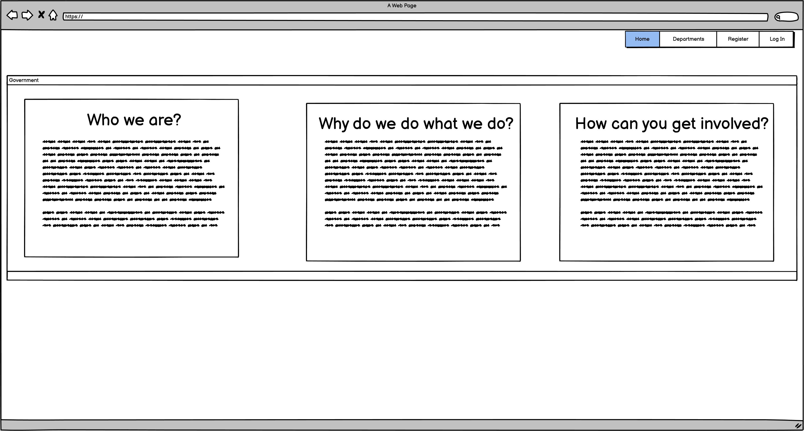

# Fun-N-Games README
Here is a link to the website [Fun-N-Games](https://fun-n-games.herokuapp.com/home)

## What is this ReadME for?
This is the ReadMe for the website Fun-N-Games. Fun-N-Games is an e-commerce toystore website built using Django an application with the use of Python, HTML, CSS, JavaScript. The Products, User Accounts and Models are in a SQL Elephant Database and static files such as images and CSS are stored with AWS. 

## Table of Contents
* [User Experience Design (UX)](#UX)
    * [The Strategy Plane](#The-Strategy-Plane)
        * [Site Goals](#Site-Goals)
        * [User Stories](#User-Stories)
    * [The Scope Plane](#The-Scope-Plane)
    * [The Structure Plane](#The-Structure-Plane)
    * [The Skeleton Plane](#The-Skeleton-Plane)
        * [Wireframes](#Wireframes)
    * [The Surface Plane](#The-Surface-Plane)
        * [Design](#design)
        * [Imagery](#imagery)
    * [Features](#features)
        * [Planned / Scrapped Features](#planned-/-scrapped-features)
        * [Features-Superuser](#Features-Superuser)
    * [DataSchema](#data-schema)
    * [Testing](#testing)
      * [Behaviour Driven Development (BDD)](#Behaviour-Driven-Development-BDO)
      * [Validator Testing](#validator-testing)
      * [Responsiveness](#responsiveness)
      * [Known Bugs](#known-bugs)
    * [Deployment](#deployment)
    * [Credits](#credits)
        * [Resources](#resources)
        * [Media](#media)

## UX

### The Strategy Plane
* I decided on making an E-Commerce Toy Store for my Milestone Project when browsing for a suitable dataset that fit the requirements of my project. After having spent a good few hours - longer than I had hoped to do so, I came across [Amazon-Products-Dataset](https://www.kaggle.com/datasets/promptcloud/amazon-product-dataset-2020) which was filled with thousands of different products all with photos and prices as well as details on the products. After scanning through this dataset, I noticed that there was an abundance of Toy Products in here so I decided to cut the other 8000 or so items out of this dataset and settle on a Toy Store.


#### User Stories 
* User Stories and their statuses can be found here [UserStories-GitHub-Projects](https://github.com/users/alikariminik/projects/1/views/1)

#### Site Goals 
The sites fundamental goal is to display the store's products in a clear way and allow users to review the products details and add them to their cart. Users will have the option to create an account which will allow for registered users to save delivery information for faster checkout and review past orders. Unregistered Users will still be able to access the store and make purchases.

### The Scope Plane
Features Planned
* A page which displays all of the products in one page.
* A page which only shows products that have a special offer or a discount applied.
* A check out feature which utilises Stripe payments
* An account creation system which meets standard password and account protections such as minimum characters length.
* Responsive Design allowing the user to correctly operate the site across a range of devices the user could potentially use such as Desktop, Laptop, Tablet and Mobiles.
* Be able to Create, Read, Update and Delete data on the database through the website and have these changes reflect instantly on the website (CRUD Functionality)
* The site should be fully accessible for keyboard users
* The site should be fully accessible for screen reader users

### The Structure Plane 
User Story: 
> As a User, I want to be able to search for, filter & sort products in the store

Acceptance Criteria:
* User should be able to search for products using the search bar, filter by catergories and sort by price.

Implementation:
* A Search Bar, NavBar with links to filter by categories will available on all pages of the site. Sort options will be confined to products pages.

User Story: 
> As a User, I want to be able to view all products which are on sale so that I can make savings by purchasing only discounted products.

Acceptance Criteria:
* User should be able to view only products which have a sale or special offer attached to them.

Implementation:
* A seperate products page is created which will only show products on sale and ones which have a special offer on them.

User Story: 
> As a User, I want to be able to log in to my account so that I can review my past orders and save default delivery details

Acceptance Criteria:
* Users should be able to view previous orders and saved default delivery details. 

Implementation:
* A profile page to be implemented for registered users which will display past orders and currently saved delivery information with the option to update this through a form.

User Story:
> As a User, I want to receive email confirmations when I create an account so that I know the account creation was successful.

Acceptance Criteria:
* When a user creates an account, an email verifying this is sent out. 

Implementation:
* To be implemented through Allauth and Django.

User Story:
> As a User, I want to be able to add a product to my cart, adjust its quantity and remove it without exiting the browser session so that I can browse and make changes to my cart if I want to.

Acceptance Criteria:
* Users should be able to make any edits to their cart in terms of quantity and products.

Implementation:
* A cart overview page where edits and removals can be made.

User Story: 
> As a User, I want to be able to review my cart prior to making a purchase.

Acceptance Criteria:
* A Cart preview should appear on the same page as where the payment is placed. 

Implementation:
* The Cart's Items will be rendered to the view in which the payment form is held.

User Story:
> As a User, I want to be able to save my default delivery details to my profile to allow for quicker checkouts in the future.

Acceptance Criteria:
* Users delivery information should be saved to their account (if they wish to) when making a purchase

Implementation:
* The User's profile page should display saved delivery information.

User Story:
> As a User, I want to be able to update my default delivery details without needing to purchase anything.

Acceptance Criteria:
* Delivery details should be able to be updated without needing to place an order.

Implementations:
* In the User's Profile page, where saved delivery details are stored, there should be an option to update these details.

User Story:
> As a Store Owner, I want to be able to add new products to my store so that I can offer the news toys to customers

Acceptance Criteria:
* Superuser can add new products to the store database and these will immediately show on the website.

Implementation:
* An Add Product Form, accessible only to Superusers that will allow for new products to be created when a name, price, and details details are given.

User Story: 
> As a Store Owner, I want to be able to edit the details of existing products in the store so that I can make changes where necessary (such as price increases / decreases or product name)

Acceptance Criteria:
* Superuser can edit any of the fields of exisiting products

Implementation:
* An Edit Product Form, accessible only to Superusers that will allow for name, price, details, image etc changes.

User Story:
> As a Store Owner, I want to be able to put products of my choice onto sale and dynamically set the sale price so that I can have frequently reduce product prices in order to increase the likelihood of sales

Acceptance Criteria:
* Superusers should be able to put any product on sale or attach a special offer to them. 

Implementation:
* Through the same Edit Form mentioned in the previous user story or through the django-admin, sales and deals can be attached to any product of the Store Owner's choice.

User Story:
> As a Store Owner, I want to be able to allow users to create accounts using their social media accounts so that I can make it quicker for users and increase the likelihood that they will use our store.

Acceptance Criteria:
* Users can create an account through their existing social media accounts

Implementation:
* To be implemented through Allauth.

### The Skeleton Plane
#### Wireframes
I utilised Balsamiq to produce my wireframes of how the app homescreen would appear across different devices. This was not stuck to.l

Mobile Device Wireframes 
 
Tablet Device Wireframes
 
Desktop Device Wireframes
 


### The Surface Plane
#### Design 
The area I felt this project lacked in the most was the design. I have relied very heavily on Bootstrap which has been extremely helpful for quick development whilst ensuring responsiveness and performance across varying screen views. However, I feel as though had I had more time to spend on this project, I would have improved the design more by adding more of my own custom CSS and utilised an eye-catching colour pallet 


#### Imagery
The images for the products are obtained directly from where they are hosted online on Amazon. This was a downside of the dataset I found in that it did not have a file with images seperate. This can can effect performance when loading All Products as there are over 2000 images being downloaded. Additionally, if the product image was ever removed from its original hosting site (for which I have no control over) then this site would not be able to retrieve the product image. However, as a safeguard for this, there is a backup image. 

### Features
The application allows for account creation through the use off Django-Allauth which allows users to create accounts, sign out and log in to their created accounts. There is the functionality to filter by category, input search queries that returns matches to product names and descriptions and sorting by price: high - low and low - high. 

Products can be added to a cart which will immediately trigger the subtotal in the top right of a user's screen to update including delivery fees if applicable. Users can make changes to their cart by adding, removing and editing the quantity of items. 

These products in the cart can again be reviewed in the Checkout. They then proceed to checkout which creates a Stripe Payment Intent and card element which needs to be populated in order to place an order. If this fails, then the user will be notified of this through the use of Bootstrap Toasts (used across the site to display helpful messages). If the payment submission is successful, then the user is redirected to a checkout success screen which provides the user with an order number and order details below. 

If the user is signed into an account, then they have the option to save default delivery details whilst in the checkout and this can later be updated in the account profile. This view also displays a users order history. 

#### Features-Superuser
Username: funngames-admin-super 
Password: 2=gE6Jz/

Superusers have full CRUD functionality qhich allows for new products to be added to the database, an exisiting products be edited and also products deletion.

This is handy for when a store owner may wish to add a discount (Models.CouponCodes) or a special offer (Models.Deal) to a given product. 

#### Planned / Scrapped Features
When starting out, I had planned to allow for users to register accounts through their Social Media accounts. This is outlined in one of the User Stories. I believe that this feature would have been a nice touch and if it were utilised in a real store, then it is likely to increase the chance of custom as an account can usually be created in just a couple of taps / clicks. 

### Languages Used

-   [HTML5](https://en.wikipedia.org/wiki/HTML5)
-   [CSS3](https://en.wikipedia.org/wiki/Cascading_Style_Sheets)
-   [JavaScript](https://en.wikipedia.org/wiki/JavaScript)
-   [Python](https://en.wikipedia.org/wiki/Python_(programming_language))

### Frameworks, Libraries & Programs Used
-   [Django](https://www.djangoproject.com/) 
    - Django is a high-level Python web framework that encourages rapid development and clean, pragmatic design.
-   [Font Awesome:](https://fontawesome.com/)
    - Font Awesome icons were used across the pages which acted as buttons to aid navigation for the user. The Font Awesome Icons themselves were also added for aesthetic and UX purposes.
-   [Bootstrap 5.3](https://getbootstrap.com/)
    - Bootstrap was used to assist with the responsiveness, layout, design and JavaScript components on the website
-   [elephantsql](https://www.elephantsql.com/)
    - The Relational Database was hosted on elephantsql and its data is obtained through the use of
-   [AWS](https://aws.amazon.com/)
    - Used to store images and static files.
-   [Stripe](https://stripe.com/gb)
    - Used as the payment handler for product purchases.
## Data Schema

### Profiles
#### UserProfile
-   User = A one-to-one relationship with User from Django Allauth "User"
-   default_street_address1 = Character Field storing first line address
-   default_street_address2 = Character Field storing second line address
-   default_town_or_city = Character Field storing town / city name
-   default_postcode = Character Field storing postcode / Zip
-   default_county = Character Field storing county / state
-   default_country = Dropdown selector used to capture country
-   default_phone_number = Character Field storing mobile phone number

### Products
#### Product 
-   uniq_id =IntegerField(null=True, blank=True)
-   name =254)
-   category = A many-to-many relationship with the Category model
-   sub_category1 = Character Field. Initial plans to incorporate sub-categories of products but this was mot implemented.
-   sub_category2 = Character Field. Initial plans to incorporate sub-categories of products but this was mot implemented.
-   price = Decimal field which stores product price.
-   product_description = Character field which stores product description. 
-   product_url = URL Field which stores product image.
-   coupon_codes = A many-to-many relationship with the CouponCode model. Allows for Discounts to be applied to products.
-   deal = A many-to-many relationship with the Deal model. Allows for Special Offers to be applied to products.

#### Category
-   name = Character field containing category name. Allows for filtering by category in the store.
-   friendly_name =  Character field containing category name displayed in an user-friendly name.

#### CouponCode
-   Percentage = Integer field which will deduct a given percentage from the product price. User to apply sales. 
-   Name = Character field use to render the value of the saving in percentage.
-   discount_amount = Not used Character field. Initial idea was to calculate value of the saving between old and sale price for a product.

#### Deal
-   name = Character field capturing name of Deal (3for2).
-   eligible_quantity = IntegerField used to calculate if Special Offer criteria is met (3). 
-   saved_quantity = IntegerField used to calculate if Special Offer criteria is met (For every 3 in Cart, deduct 1).

## Testing 
### Behaviour Driven Development (BDD)
- Testing of User Stories was conducted and documented in [bdd_testing.txt](tests/bdd_testing.txt)

### Validator Testing
* HTML
    *   [W3C Validator](https://validator.w3.org/nu/)
        * No major issues in HTML files. Only errors arise from Django templating.
* CSS
    *   [Jigsaw Validator](https://jigsaw.w3.org/css-validator/#validate_by_input)
        * No issues in CSS files.
* JavaScript
    *   [JSlint Validator](https://www.jslint.com/)
        * No major issues in JS files.
* Python
    *   [Python Validator](http://ww1.pep8online.com/)
        * No major issues in python files.

### Responsiveness
Vigorous testing was conducted throughout the development process to ensure that the site maintained responsiveness as more elements were added on. Using developer tools and adjusting screen dimensions, I have checked to ensure that all content displays clearly over a variety of screen sizes - primarily on the Mobile, Tablet and Monitors. As mentioned above, media queries were added to correct responsiveness failings from Materialize.

### Known Bugs
- At times, the All Products page can load quite slowly due to the number of items being rendered on it. I explored paginating this view but in doing so, this broke other features such as as sorting and filtering so this was scrapped. Had I been aware of these performance issues in the live project, I would certainly have incorporated pagination into my project earlier on.

## Deployment

### Forking the GitHub Repository

By forking the GitHub Repository you can make a copy of the original repository on your GitHub account to view and/or make changes without affecting the original repository. This can be done by folling these steps below:

1. Log in to GitHub and locate the [GitHub
   Repository](https://github.com/alikariminik/Fun-n-Games-MSP4)
2. At the top of the Repository (not top of page) just above the "Settings"
   Button on the menu, locate the "Fork" Button.
3. Click the button (not the number to the right) and you should now have a copy
   of the original repository in your GitHub account.

### Making a Local Clone

1. Log in to GitHub and locate the [GitHub Repository](https://github.com/alikariminik/Fun-n-Games-MSP4).
2. Under the repository name, click "Code".
3. To clone the repository using HTTPS, under "HTTPS", copy the link.
4. Open your local terminal with git installed
5. Change the current working directory to the location where you want the cloned directory to be created.
6. Type `git clone`, and then paste the URL you copied in Step 3.

    ```Terminal
    ~$ git clone https://github.com/alikariminik/Fun-n-Games-MSP4.git
    ```

7. Press Enter. Your local clone will be created.

    ```Terminal
    $ git clone https://github.com/alikariminik/Fun-n-Games-MSP4.git
    > Cloning into `test-dir`...
    > remote: Counting objects: 10, done.
    > remote: Compressing objects: 100% (8/8), done.
    > remove: Total 10 (delta 1), reused 10 (delta 1)
    > Unpacking objects: 100% (10/10), done.
    ```

### Deploying with Heroku

1. Log in to [Heroku](https://www.heroku.com/) and  navigate to your personal app dashboard.
2. At the top of the page locate the 'New' drop down, click it and then select 'Create new app'.
3. Give your application a unique name, select the nearest region to your location and click the 'Create app' button.
4. From the menu towards the top of the page select the 'Settings' section and click on 'Reveal Config Vars' in the Config vars section. Add in the Key:Value pairings for environment variables that are required for this app:
 - `AWS_ACCESS_KEY_ID` : Generated from S3 IAM
 - `AWS_SECRET_ACCESS_KEY` : Generated from S3 IAM 
 - `DATABASE_URL` : Database URL for the hosting database - Elephant SQL. 
 - `EMAIL_HOST_PASS` : Passcord generated from gmail 
 - `EMAIL_HOST_USER` : Email address used to send emails from
 - `HEROKU_POSTGRESQL_ORANGE_URL` : 
 - `SECRET_KEY` : Your Django Secret Key
 - `STRIPE_PUBLIC_KEY`: Stripe Public Key for handling payments
 - `STRIPE_SECRET_KEY` : Stripe Private Key for handling payments
 - `USE_AWS` : Set to True 

5. Back in your GitPod Workspace, install install dj_database_url and psycopg2 and update requirements.txt file using the following commands
    ```Terminal
      $  pip3 install dj_database_url==0.5.0 psycopg2
      $  pip freeze > requirements.txt
    ```
6. In your settings.py file, import dj_database_url underneath the import for os.
7. Comment out DATABASES section in settings.py and instead wire up `DATABASES` =  'default': dj_database_url.parse('your-database-url-here'). Be sure not to commit this file with your database string in the code. This is temporary.
8. In the terminal, run  `python3 manage.py showmigrations`
9. Ensure that all migrations are unchecked.
10. Migrate your database models to new database using `python3 manage.py migrate`
11. Load in Fixtures using the following commands
-   `python3 manage.py loaddata categories`
-   `python3 manage.py loaddata products`

12. Create a new superuser using the following command and follow the steps in the terminal : ` python3 manage.py createsuperuser`

13. Uncomment out the Database code and delete `DATABASES` =  'default': dj_database_url.parse('your-database-url-here').
14. In the terminal, Install Unicorn by using the following command and update requirements.txt.

    ```Terminal
      $  `pip3 install gunicorn`. 
      $  pip freeze > requirements.txt
    ```

15. Create a Procfile and populate the first line with - "web: gunicorn funngames.wsgi:application"
16. Login into Heroku through the terminal through using heroku_config.
17. Enter your Heroku API key which can be obtained from Account Settings > API Key.
18. Disable collect_static by typing in the terminal:

  ```Terminal
      $  `heroku config:set DISABLE_COLLECTSTATIC=1 --app fun-n-games`
    ```
19. Add `https://fun-n-games.herokuapp.com/`  to `ALLOWED_HOSTS` in settings.py.
20. Add, commit and push changes to GitHub.
21. Back on Heroku, in fun-n-games dashboard, select on the Deploy tab and connect this app to GitHub.
22. Turn on Automatic Deploys. 
23. Select Deploy Branch to ensure the most up-to-date git commit is in the heroku app.

## Credits

#### Resources 
- Code Institute course material
- Code Institute Mentor
- [CodeInstitute-ReadME](https://github.com/Code-Institute-Solutions/SampleREADME)


#### Media 
- [FnGHeroImage](https://www.flickr.com/photos/30478819@N08/44289962475)
- [FnGLogo](https://www.freelogodesign.org/) Generated from freelogodesign.org
- [No-Image-Placeholder](https://commons.wikimedia.org/wiki/File:No-Image-Placeholder.svg)